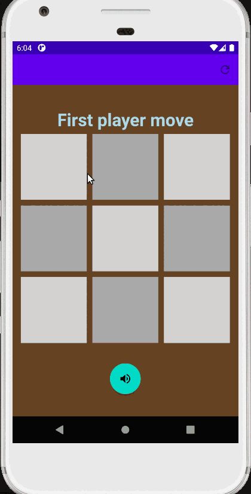

# TickTackToe
Tic tack toe game. Offers one and two player mode.
Game sounds from https://www.freesoundslibrary.com/

<h3>User can:</h3>

- play in one or two player mode,
- turn game sounds on and off,
- choose between three difficulty levels,
- choose between cross, circle, red circle and green circle as pawns,
- reset settings to default values

<h3>Used technologies:</h3>

- kotlin,
- fade in animations,
- custom menu bar,
- spinner,
- shared preferences for storing settings,
- MediaPlayer,
- finding views from layout with view binding.

<h3>App screenshots:</h3>

Main Menu Screen          |  Game screen | Settings screen
:-------------------------:|:-------------------------:|:-------------------------:
  |  |  

<h3>App during usage:</h3>

Game           |  Setings
:-------------------------:|:-------------------------:
  |   
